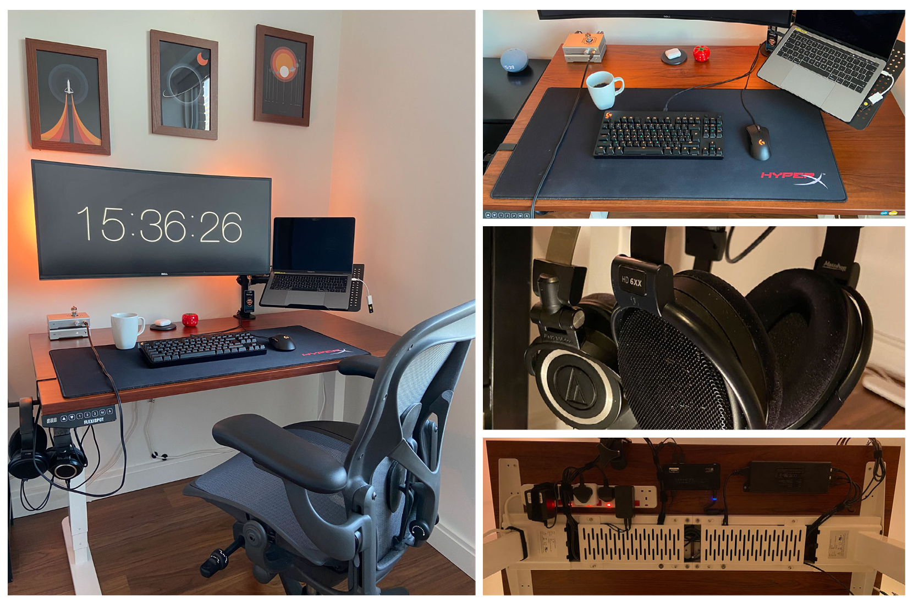
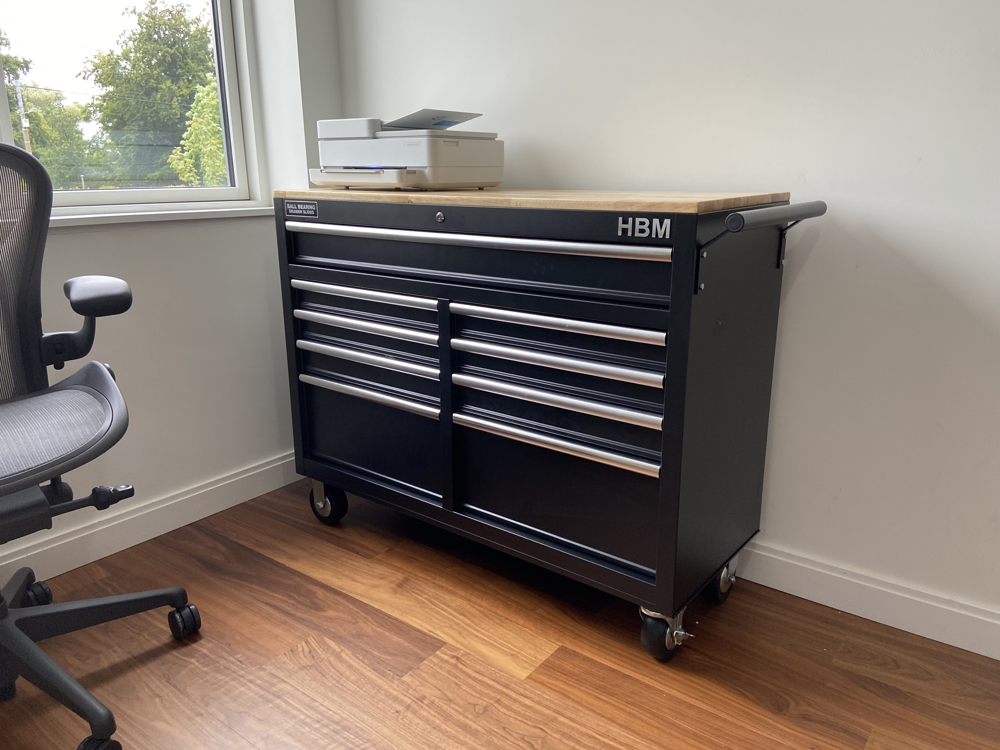

# Ambiente de Trabalho



Durante esse quase um ano trabalhando exclusivamente de casa fui customizando meu ambiente de trabalho deixando gradativamente mais confortável e agradável.

 ```diff
# Provavelmente gastei mais tempo do que deveira em pesquisas, e bem, aqui estão meus achados
+ As coisa que gosto
- E que não gosto sobre eles
 ```

### Mesa
- Frame https://amzn.to/3lY1Bo6
```diff
+ Range de altura
+ Largura ajustavel
+ Porta serial para hacker -> https://github.com/rodrigorznd/LoctekMotion_ArduinoIoTCloud
- Não tem sistema de anti-colisão
```
- Tampo https://amzn.to/36SOUXk
```diff
- Tamanho  # gostaria de ter uma mesa com 160cm de largura, mas eu não tenho espaço sufiente
```

### Cadeira
- Herman Miller Aeron Chair https://www.hermanmiller.com/en_eur/products/seating/office-chairs/aeron-chairs/
```diff
# Vale dizer que tenho problema na lombar, por isso o investimento nessa cadeira
+ Extramemente confortável
+ Garantia de 12 anos
+ Sem mais dores na lombar 
```

### Monitor
- Dell U3419W https://amzn.to/2VQjJWn

```diff
+ Porta USB-C
+ Tela confortável
```
##### Suporte
- Dual Monitor Stand for 15-35 inch Ultrawide Screens https://amzn.to/3wjqEdQ
```diff
+ Ocupa pouco espaço na mesa
+ Pistão a gás
+ Portas USB
```

### Periféricos
##### Teclado
- Logitech G PRO Mechanical https://amzn.to/3oFrNFT
```diff
+ Confortável
- Depende do software pra configurações
# Se você se incomoda com barulho os switches GX Blue Clicky podem incomodar bastante
```
##### Mouse
- Logitech MX Vertical Ergonomic https://amzn.to/3wscZl9

##### Webcam

- Logitech C920 HD Pro https://www.amazon.co.uk/gp/product/B006A2Q81M

##### Impressora
- HP ENVY Pro 6430 All-in-One Printer https://amzn.to/2VUgDk8

```diff
# Fui obrigado pela burocracia Irlandesa
+ Conexão via Wifi
- Provevelmente descartável 
```
##### Extras
- Mouse pad XL (90cm x 42cm) https://amzn.to/2LjPtkE

### Audio
```diff
# Pretendo escrever um review sobre esses no futuro, mas posso adiantar 
# que foi um excelente investimento.
```
- Schiit Modi3 https://www.schiit.com/products/modi-1
- Schiit Vali2 https://www.schiit.com/products/vali-3
- Sennheiser HD6xx https://drop.com/buy/massdrop-sennheiser-hd6xx (https://drop.com/?referer=KX7BLH)
##### Extras 
- ADV. Dual Suspension Headphone Hanger https://drop.com/buy/advanced-sound-dual-suspension-headphone-hanger (https://drop.com/?referer=KX7BLH)
```diff
+ Libera espaço na mesa
```

### Organização

- HBM Mobile Tool Trolley https://bit.ly/3fFxUHW

### Decoracão

##### Iluminação
- Philips Hue Play White and Colour Ambiance Smart Light Bar https://amzn.to/3m1npPA
##### Quadros
- Rocket print https://www.etsy.com/ie/listing/868867703/rocket-print-space-wall-art-space
- Space shuttle print https://www.etsy.com/ie/listing/861204842/space-shuttle-print-planet-solar-system
- Solar system print https://www.etsy.com/ie/listing/854961426/solar-system-print-space-wall-art-space
- Handmade Photo Frame https://www.etsy.com/ie/listing/871348407/handmade-photo-frames-casual-picture

### extras
- DELL D6000 With USB 3.0 https://amzn.to/3qFGREX
- ~~Surge Protected Extension Lead 3m https://amzn.to/3gqvyfb~~
- 6-way socket with 6 switches 3m https://www.ikea.com/ie/en/p/koppla-6-way-socket-with-6-switches-earthed-white-10392663/
- Cable Ties Self Adhesive https://amzn.to/39YTSUx
- Cable Holders https://amzn.to/36UwtkT
- Analogue Timer Tomato Red  https://amzn.to/3qDYq8B
